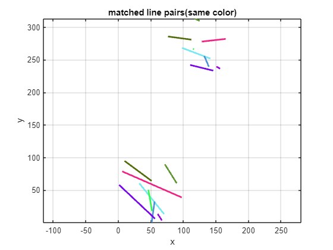

<a name="T_D514E8BB"></a>

# <span style="color:rgb(213,80,0)">基于2D平面匹配的点集和直线同时进行鲁棒性的刚性变换矩阵估计</span>

[](https://matlab.mathworks.com/open/github/v1?repo=cuixing158/estgeotform2d&file=demo.mlx)

崔星星 2023.10

<cuixingxing150@gamil.com>

如何对2D平面中已知匹配的点和直线进行刚性变换矩阵(只有旋转和平移共3个自由度)鲁棒求解是一个技术问题。虽然表面上问题看起来较为简单，但"知易行难"。就目前我个人有限认知的情况下， 暂没有发现有现成的库函数或者开源代码实现匹配的点和线同时进行鲁棒估计，如有请留言告知，提前感谢。

本文主要阐述自己亲自实现的函数*estgeotform2dForPtsAndLines*如何使用，特别对含有噪音的匹配进行鲁棒估计，并直接与SVD方法、内置的[estgeotform2d](https://ww2.mathworks.cn/help/vision/ref/estgeotform2d.html)函数进行对比，以及解决有匹配的直线时候，此时内置函数无法解决的问题。

<a name="beginToc"></a>

## 目录

[语法](#H_7DDF3F84)

[两组准确匹配点](#H_42B0927A)

&emsp;[method1:SVD直接求解](#H_E151AD3E)

&emsp;[method2:OpenCV内置方法求解](#H_7B0B91CA)

[多组匹配点线集同时鲁棒估计计算](#H_2559BA5E)

[多组匹配点集同时鲁棒估计计算](#H_C4D40633)

[总结](#H_08A25980)

[辅助函数](#H_9899F28F)

<a name="endToc"></a>
<a name="H_7DDF3F84"></a>

# 语法

<pre>
[tform, inlierIndex, status] = estgeotform2dForPtsAndLines(matchedPoints1,matchedPoints2,matchedLines1,matchedLines2)
</pre>

语法简要说明：

- 输入：

matchedPoints1与matchedPoints2为匹配的二维点集坐标，若没有匹配，则传入为\[\]；

matchedLines1与matchedLines2为匹配的二维直线（以线段表征）集端点坐标，若没有匹配，则传入为\[\]；

- 输出：

tform：2x3的刚性转换矩阵；

inlierIndex：对每组输入量指示是否为inlier标志；

status： 估计结果的状态量标志。

*更详细的帮助和用法请执行以下命令：*

<pre>
help estgeotform2dForPtsAndLines
</pre>
<a name="H_42B0927A"></a>

# 两组准确匹配点

设计理论数据，两组匹配点集 $p$ 和 $q$ 以及他们之间的理论变换旋转角度 $\theta =30$ 度和平移向量 $t=[100,200]$ 。

```matlab
theta = 30;
t = [100,200];

R_theory = [cosd(theta),-sind(theta);
    sind(theta),cosd(theta)]
```

```matlabTextOutput
R_theory = 2x2    
    0.8660   -0.5000
    0.5000    0.8660

```

```matlab
t_theory = t
```

```matlabTextOutput
t_theory = 1x2    
   100   200

```

点集 $p$ 中的2个点坐标分别为 $(0,0),(100,0)$ ,通过按照上述变换计算目标点集 $q$ 。

```matlab
p = [0,0;
    100,0];
q_theory = R_theory*p'+t_theory';
q = q_theory'
```

```matlabTextOutput
q = 2x2    
  100.0000  200.0000
  186.6025  250.0000

```

<a name="H_E151AD3E"></a>

## method1:SVD直接求解

直接调用内建函数SVD求解旋转矩阵 $R$ , $t$

```matlab
[R1,t1] = computeRigidTransform(p,q)
```

```matlabTextOutput
R1 = 2x2    
    0.8660   -0.5000
    0.5000    0.8660

t1 = 2x1    
  100.0000
  200.0000

```

<a name="H_7B0B91CA"></a>

## method2:OpenCV内置方法求解

按照opencv的[estimateAffinePartial2D函数原理](https://github.com/opencv/opencv/blob/38bc519e4aa5c1cc9b299f2e94fd3ed00cf8df7b/modules/calib3d/src/ptsetreg.cpp#L715)分析求解 $R$ , $t$ 。注意：*estimateAffinePartial2D* 的结果为求解的相似变换矩阵估计，共4个自由度。

```matlab
x1 = p(1,1);
y1 = p(1,2);
x2 = p(2,1);
y2 = p(2,2);

X1 = q(1,1);
Y1 = q(1,2);
X2 = q(2,1);
Y2 = q(2,2);

% we are solving AS = B
%     | x1 -y1 1 0 |
%     | y1  x1 0 1 |
% A = | x2 -y2 1 0 |
%     | y2  x2 0 1 |
% B = (X1, Y1, X2, Y2).t()
% we solve that analytically
% 

d = 1./((x1-x2).^2+(y1-y2).^2);
% solution vector
S0 = d*((X1 - X2) * (x1 - x2) + (Y1 - Y2) * (y1 - y2));
S1 = d*((Y1 - Y2) * (x1 - x2) - (X1 - X2) * (y1 - y2));
S2 = d*((Y1 - Y2) * (x1 * y2 - x2 * y1) - (X1 * y2 - X2 * y1) * (y1 - y2) - (X1 * x2 - X2 * x1) * (x1 - x2));
S3 = d*(-(X1 - X2) * (x1 * y2 - x2 * y1) - (Y1 * x2 - Y2 * x1) * (x1 - x2) - (Y1 * y2 - Y2 * y1) * (y1 - y2));

% set model, rotation part is antisymmetric
R2_s = [S0,-S1;
    S1,S0];
t2 = [S2,S3];
scale = sqrt(det(R2_s))
```

```matlabTextOutput
scale = 1.0000
```

```matlab
R2 = R2_s./scale
```

```matlabTextOutput
R2 = 2x2    
    0.8660   -0.5000
    0.5000    0.8660

```

```matlab
t2 = t2./scale
```

```matlabTextOutput
t2 = 1x2    
  100.0000  200.0000

```

此时scale正好等于1，即两组点集被作为一个刚性变换估计与方法1是一样的。如果超过两组点集并且伴有噪音，那么scale大概率不为1，即使试图强加scale按照上述计算 $R$ 和 $t$ ,会导致最终结果不准确，故此方法在刚性变换领域不适用。

<a name="H_2559BA5E"></a>

# 多组匹配点线集同时鲁棒估计计算

为多组匹配的点+直线/线段设计理论数据，同样，他们之间的理论变换设计为旋转角度 $\theta =30$ 度和平移向量 $t=[100,200]$ 。

1. 设计任意匹配的点对为100，并试图加入噪音。

```matlab
numPts = 100;
matchedPts1 = 100*rand(numPts,2);
matchedPts2_exact = R_theory*matchedPts1'+t_theory';
pointsNoises = 5*rand(numPts,2);
matchedPts2 = matchedPts2_exact'+pointsNoises;
```

2. 设计任意匹配的直线/线段，同样匹配的线对为100条，匹配的线只要求方向尽可能一致，直线/线段2个端点不一定完全匹配重合，即直线/线段长度不完全匹配。

matchedL1和matchedL2均为 $n\times 4$ 大小的矩阵，每行代表一条直线/线段,以 $[x1,y1,x2,y2]$ 格式存储两个顺序的端点坐标。matchedL1为任意的直线/线段数据，经理论变换后加入噪音linesNoises得到匹配的直线/线段matchedL2。

```matlab
numLines = 100;
matchedL1 = 100*rand(numLines,4);
pts1 = R_theory*matchedL1(:,1:2)'+t_theory';
pts2_exact = R_theory*matchedL1(:,3:4)'+t_theory';
```

变换后的直线/线段matchedL2起始点坐标集为 $pts1$ ，对应的终点坐标集为 $pts2$ ,为保证与直线/线段matchedL1方向一致，取其方向向量 $l=pts2-pts1$ ,直线/线段长度由正值的一致性尺度因子 $s$ 确定，考虑噪声,给终点坐标集 $pts2$ 加入linesNoises。

```matlab
l = pts2_exact-pts1;
s = rand(1,numLines);
linesNoises = rand(2,numLines);
pts2 = pts1+s.*l+linesNoises; % random length,but minor direction changes
matchedL2 = [pts1',pts2'];
```

此时matchedL2为含有噪音且长度不一样的匹配matchedL1的直线/线段。为预览匹配的直线/线段组，任意可视化8组，并标注颜色相同的为一组匹配。

```matlab
% plot matching line pairs
helperPlotMatchedLines(matchedL1,matchedL2,8);
```

<center></center>

容易看出上图中不同直线/线段的相对角度和位置符合直观感受。

3. 根据以上含有噪音的匹配点集和直线/线段集调用自定义函数estgeotform2dForPtsAndLines求解刚性变换矩阵和一些状态变量并统计运行时间。

```matlab
[tformT, inlierIndexT, statusT] = estgeotform2dForPtsAndLines(matchedPts1,matchedPts2,matchedL1,matchedL2);
h1 = @()estgeotform2dForPtsAndLines(matchedPts1,matchedPts2,matchedL1,matchedL2);
t_mine = timeit(h1,3)
```

```matlabTextOutput
t_mine = 0.0023
```

```matlab
estimate_R = blkdiag(tformT(1:2,1:2),1); % convert to homogenous matrix
estimate_t = tformT(:,3)
```

```matlabTextOutput
estimate_t = 2x1    
  101.3665
  200.8927

```

```matlab
estimate_thetas = rotm2eul(estimate_R);
estimete_theta = rad2deg(estimate_thetas(1))
```

```matlabTextOutput
estimete_theta = 29.7912
```

从结果可以看出，与理论值旋转角度 $\theta =30$ 度和平移向量 $t=[100,200]$ 很近似了。

<a name="H_C4D40633"></a>

# 多组匹配点集同时鲁棒估计计算

由于内置的[estgeotform2d](https://ww2.mathworks.cn/help/vision/ref/estgeotform2d.html)函数只适用于点集，为便于对比分析，故仍然针对上述点集计算刚性变换矩阵，并统计运行时间。

```matlab
[tform2, inlierIndex2, status2] = estgeotform2d(matchedPts1,matchedPts2,"rigid");
h2 = @()estgeotform2d(matchedPts1,matchedPts2,"rigid");
t_buildin = timeit(h2,3)
```

```matlabTextOutput
t_buildin = 0.0050
```

```matlab
estimate_R = blkdiag(tform2.A(1:2,1:2),1); % convert to homogenous matrix
estimate_t = tform2.A(1:2,3)
```

```matlabTextOutput
estimate_t = 2x1    
  100.6170
  202.3318

```

```matlab
estimate_thetas = rotm2eul(estimate_R);
estimete_theta = rad2deg(estimate_thetas(1))
```

```matlabTextOutput
estimete_theta = 28.4594
```

同样，从结果可以看出，与理论值旋转角度 $\theta =30$ 度和平移向量 $t=[100,200]$ 比较近似了。但自己的实现耗时更少！

<a name="H_08A25980"></a>

# 总结

自己实现的函数*estgeotform2dForPtsAndLines*比一些传统内置函数耗时更少，而且针对没有点或者点集数量较少的情况下，该函数还能结合直线/线段更加鲁棒的估计。

<a name="H_9899F28F"></a>

# 辅助函数

```matlab
function helperPlotMatchedLines(lines1,lines2,topk)
arguments
    lines1 (:,4) double 
    lines2 (:,4) double 
    topk  (1,1) int32 = 5
end
xx = [lines1(1:topk,1),lines1(1:topk,3)];
yy = [lines1(1:topk,2),lines1(1:topk,4)];
xx1 = [lines2(1:topk,1),lines2(1:topk,3)];
yy1 = [lines2(1:topk,2),lines2(1:topk,4)];

figure(Name="matching lines");
colororder(rand(topk,3));

plot(xx',yy',LineWidth=2);
hold on;
plot(xx1',yy1',LineWidth=2);
axis equal
grid on
title("matched line pairs(same color)");
xlabel("x");
ylabel("y");
end
```
